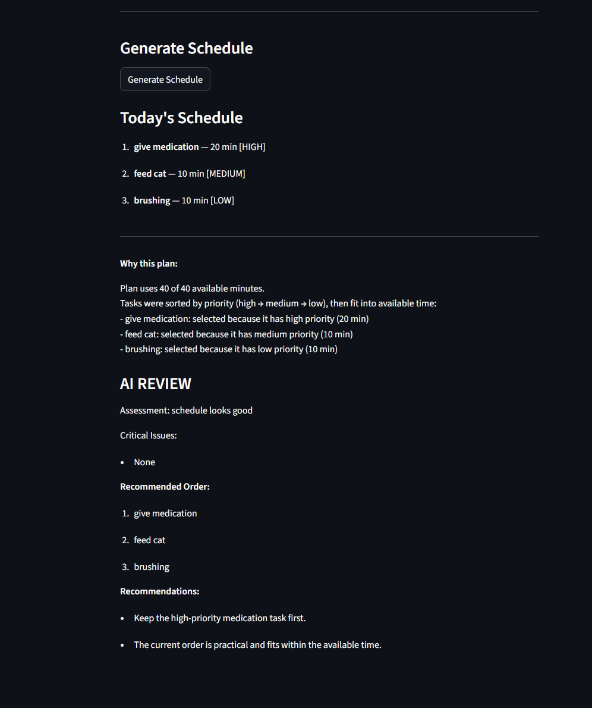
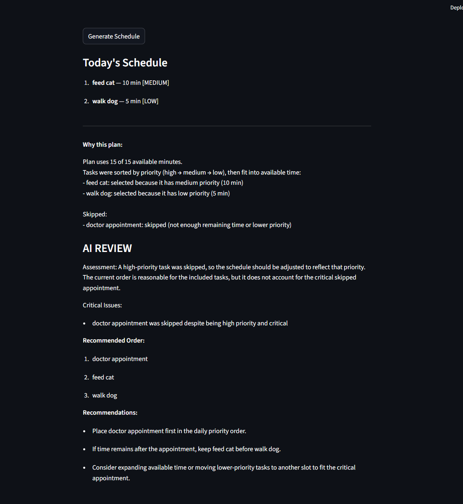

# TF WEEKLY TASKS SUMMARY 


# Pawpal+ AI Scheduler

PawPal+ AI Scheduler is an intelligent pet-care planning system that combines rule-based scheduling with AI-powered review. The system generates a daily schedule and then uses AI to evaluate its quality, detect critical issues such as skipped high-priority tasks and recommend improvements. 

This matters because real-world scheduling often involves trade-offs, and the AI layer helps identify when a "valid" plan is still not a "good" plan.
By combining deterministic logic with AI reasoning, the system helps busy pet owners maintain a reliable and well-balanced daily schedule.

## Original Project (Pawpal+)

The original project, PawPal+, is a rule-based pet care scheduling system that helps pet owner organize daily tasks based on priority and time constraints. It allows users to input pets, tasks, and available time, then generates a daily plan by prioritizing high-importance tasks and fitting them within the available schedule. 

The system also provided explanations fro why tasks were selected or skipped, helping users understand scheduling decisions. 

## Architecture Overview

The system follows a hybrid approach combining deterministic logic with AI reasoning: 

User Input
(owner, pets, tasks, time)
        ↓
Rule-Based Scheduler
        ↓
Schedule Summary Builder
        ↓
AI Review Agent
        ↓
Final Output (Plan + AI Feedback)
        ↓
Human / Testing Layer

- The scheduler generates a feasible plan based on constraints.
- A summary builder structures the plan into meaningful data.
- The AI reviewer evaluates the plan, identifies issues, and suggests improvements.
- A testing/human layer validates correctness and refines behavior.

## Getting started

### Setup

1. Clone the repo 

```bash

git clone <repo_url>
cd applied-ai-system-project

python -m venv .venv
source .venv/bin/activate  # Windows: .venv\Scripts\activate
pip install -r requirements.txt
```

2. Create and Activate Virtual Environment

```bash
python -m venv .venv
source .venv/bin/activate  # Windows: .venv\Scripts\activate
```

3. Install Dependencies

```bash 

pip install -r requirements.txt
```

4. Setup environment variables 

Create a .env file and add the following:

```bash

OPENAI_API_KEY=your_api_key_here
```

5. Run the application 

Option A: Run the CLI demo 

```bash

python main.py
```

Option B: Run the Web App 

```bash

streamlit run app.py
```


## Sample Interactions

Example 1: Valid Schedule

Input

- Available time: 40 minutes
- Tasks:
    - Give Medication (20 min, high)
    - Feed Cat (10 min, medium)
    - Brushing (10 min, low)

Output



Example 2: Critical Task Skipped

Input

- Available time: 15 minutes
- Tasks:
    - Doctor Appointment (20 min, high)
    - Feed Cat (10 min, medium)
    - Walk Dog (5 min, low)

Output


## Design Decisions

Hybrid System (Rule-Based + AI)

I chose to keep the scheduler deterministic and use AI as a reviewer instead of replacing the scheduler entirely. This ensures:

- reliability (no hallucinated schedules)
- explainability (clear reasoning)
- safety (AI cannot create invalid plans)
- Structured AI Output (JSON)

The AI is required to return structured JSON. This allows:

- predictable parsing
- easy integration into the app
- better debugging and testing

Prompt Guardrails

The prompt restricts the AI to:

- only use existing task names
- prioritize high-priority skipped tasks
- avoid saying “schedule looks good” when critical issues exist

Trade-offs
- AI does not directly modify the schedule (yet)
- relies on prompt quality instead of model fine-tuning
- adds API dependency (latency + cost)


## TESTING SUMMARY 

This project includes multiple methods to ensure the AI system works reliably.

- **Automated Testing:**  
  A pytest integration test verifies that the AI reviewer returns valid structured JSON with the expected fields.

- **Logging & Error Handling:**  
  The system logs key steps in the AI pipeline (request sent, response received, parsing success/failure).  
  It also catches invalid JSON responses and raises clear errors instead of failing silently.

- **Human Evaluation:**  
  The system was tested using multiple scenarios:
  - A valid schedule where the AI correctly returned “schedule looks good”
  - A schedule where a high-priority task was skipped, where the AI correctly flagged the issue and recommended a better task order 

  The AI initially failed to prioritize skipped high-priority tasks correctly, but this was improved through prompt refinement.

**Summary:**  
3 out of 3 reliability checks passed (automated test, valid schedule case, and critical-task-skipped case).  
The AI initially struggled with prioritizing skipped high-priority tasks, but accuracy improved after refining the prompt and adding stricter rules.


## Reflection 

This project taught me that building AI systems is not just about calling a model, but about designing how the model interacts with existing logic.

I learned the importance of:
- prompt engineering and iterative refinement
- combining rule-base systems with AI for reliability
- validating AI outputs instead of blindly trusting them
- structuring outputs to integrate AI into real applications 

One key takeaway is that AI works best as a collaborator, not a replacement. By using AI to evaluate and enhance a deterministic system, I was able to create a solution that is practical and valuable for busy pet owners managing multiple responsibilites. 

## Limitations or Biases 

This system relies on both rule-based logic and AI-generated reasoning, which introduces several limitations. The scheduler itself is constrained by predefined rules (e.g., priority and duration), so it may not capture more nuanced real-world factors such as task flexibility or urgency beyond simple labels. On the AI side, the model depends heavily on prompt design and may produce inconsistent or overly confident recommendations if the input context is unclear. Additionally, because the system prioritizes tasks based on predefined categories (e.g., “high,” “medium,” “low”), it may reflect bias in how importance is assigned rather than adapting dynamically to user-specific needs.

## Potential Misuse and Prevention 

One potential misuse of this system is over-reliance on AI recommendations without human judgment. For example, a user might blindly follow the suggested task order even when it does not fully align with real-world constraints (such as appointments that cannot be rescheduled). To mitigate this, the system is intentionally designed so that AI acts as a reviewer rather than directly modifying the schedule. The rule-based scheduler remains the source of truth, and the AI only provides suggestions. Additionally, guardrails in the prompt prevent the AI from inventing tasks or producing unstructured outputs.

## What Surprised Me

One surprising aspect during testing was how easily the AI could produce responses that seemed correct but were logically inconsistent. For example, the AI initially failed to prioritize a skipped high-priority task in its recommended order, even though it correctly identified it as a critical issue. This highlighted the importance of not just checking whether the AI “sounds right,” but verifying that its outputs align with expected behavior. After refining the prompt with stricter rules, the AI’s performance improved significantly.

## Collaboration with AI for this project

Throughout this project I used AI to explain concepts that were new to me and to help me plan prior to implementing new methods. AI was helpful in helping me understand new concepts by providing clear and concise examples. Another way it helped was when debugging I would first explain what was going wrong vs what I expected and then would ask AI why the app was behaving that way. An instance where it was helpful was when my app was overlooking a high priority task simply which was not supposed to be ignored, and the suggestion was to refine my prompt. After refining my prompt it was able to handle that edge case. 